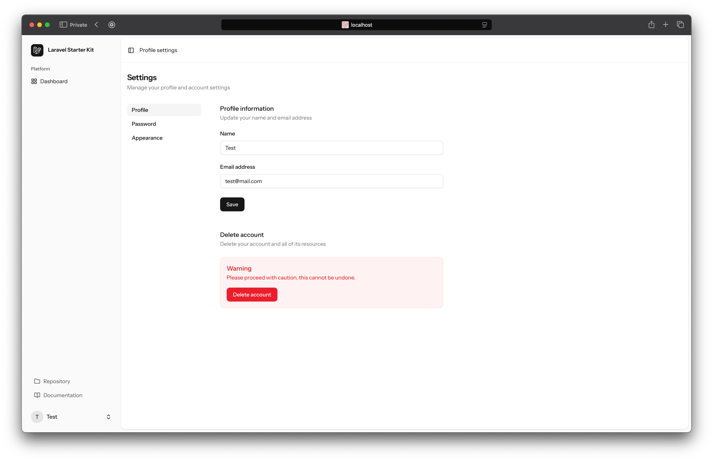

# Key-Value Versions

## Local Setup

- `git clone https://github.com/dumindu/key-value-versions.git`
- `cd key-value-versions/key-value-versions-app`
- `composer install`
- `npm install && npm run build`
- `cp .env.example .env`
- `php artisan key:generate`
- `php artisan passport:keys`
- ` ./vendor/bin/sail up`
- `./vendor/bin/sail artisan migrate`

> 💡 Need to run Docker.

## Web Dashboard



### Pages

- Register
- Login
- Profile Settings

## API Endpoints

> Use [Yaak](https://yaak.app) to access the Open API documentation/ setup in the [__openapi](__openapi) folder.

### 1. User Registration

#### Endpoint

`[POST] api/v1/register`

#### Headers

- Accept: `application/json`

#### Request Body

```json
{
  "name": "User Name",
  "email": "user@email.com",
  "password": "some_password",
  "password_confirmation": "some_password"
}
```

### 2. Get Oauth2 Tokens

#### Endpoint

`[POST] oauth/token`

#### Headers

- Accept: `application/json`

#### Request Body

```json
{
  "grant_type": "password",
  "client_id": "01989503-1ce8-735f-a487-0729ef4f1d1b",
  "client_secret": "WqkuICsupCfBL1xLt71TfBSaaLVlaiTd0iMSudpu",
  "username": "user@email.com",
  "password": "some_password",
  "scope": "*"
}
```

### 3. Create New Key/Value

#### Endpoint

`[POST] /api/v1/keys`

#### Headers

- Accept: `application/json`
- Authorization: `Bearer <access-token>`

#### Request Body

```json
{
  "key": "001",
  "value": "value 001"
}
```

### 4. Get All Keys With Latest Values

#### Endpoint

`[GET] /api/v1/keys`

#### Headers

- Accept: `application/json`
- Authorization: `Bearer <access-token>`

### 5. Get A Key With Latest Value

#### Endpoint

`[GET] /api/v1/keys/{key}`

#### Headers

- Accept: `application/json`
- Authorization: `Bearer <access-token>`

### 6. Get A Key With All Values

#### Endpoint

`[GET] /api/v1/keys/{key}/history`

#### Headers

- Accept: `application/json`
- Authorization: `Bearer <access-token>`

